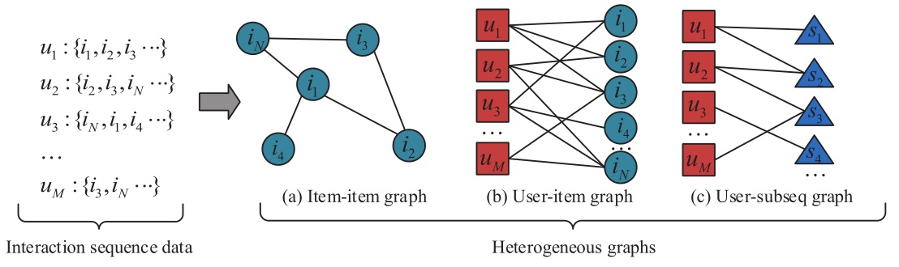
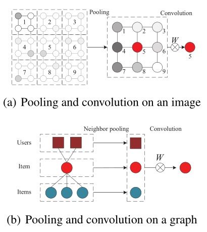

#  Path conditioned Graph Convolutional Network (PGCN)

**Key words**: graph convolution, recommender system, recommendation, vertex representation, interaction sequence

This is our implementation for the paper:

Yanan Xu, Yanmin Zhu, Yanyan Shen, and Jiadi Yu (2019). **Learning Shared Vertex Representation in Heterogeneous Graphs with Convolutional Networks for Recommendation.** In Proceedings of IJCAI'19, Macao, China, August 10-16, 2019.

Two graph convolutional neural networks: PGCN-C and PGCN-A.

PGCN-C uses static transition probability as the weights of neighbors in convolution. 
PGCN-A utilizes attention mechanism to calculate weights of neighbors.


**Please cite our IJCAI'19 paper if you use our codes. Thanks!** 

Author: Yanan Xu

## Main Idea of This Paper

### 1. Construct three heterogeneous graphs with user interaction sequences.



The user-item graph, item-item graph, user-subseq graph denote user preference, item dependency, and user similarity on behaviors, respectively.

### 2. Train the PGCN with the graphs.


### 3. Deal with a varying number of neighbors for each vertex in the graphs.



(1) Cluster neighbors of each vertex according to their distance and path type.

(2) Perform neighbor pooling operation on each cluster and generate a virtual vertex.

   We provide two kinds of neighbor pooling operation: using transition probability (PGCN-C) or attention mechanism (PGCN-A).

(3) Apply convolution to virtual vertexes and generate representations for each user and item.


## Environment Settings
We use TensorFlow to implement our model. 
- TensorFlow version:  '1.4.0'

## Structure of This Project

>|  
>|-README.md                    
>|-pgcna.py                  // PGCN-A model  
>|-pgcnaMain.py              // Main file of PGCN-A  
>|-pgcnc.py                  // PGCN-C model  
>|-pgcncMain.py              // Main file of PGCN-C   
>|-processData.py            // Load data  
>|-settings.py               // Default settings of models     
>|-evaluate.py               // Model evaluation  
>|-data  
>>|-ml_100k_top100            // MovieLens 100k dataset  
>>|-retail10_30_top100        // Retailrocket dataset  


## Example to run the codes.
```
$ python pgcnaMain.py
```
or 
```
$ python pgcncMain.py
```

### Dataset
We provide two processed datasets: [MovieLens-100k](https://grouplens.org/datasets/movielens/) and [Retailrocket](https://www.kaggle.com/retailrocket/ecommerce-dataset). 

The processed data are stored with pickle.


Last Update Date: May 30, 2019
